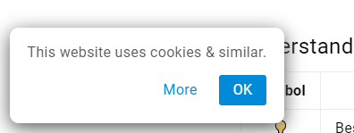
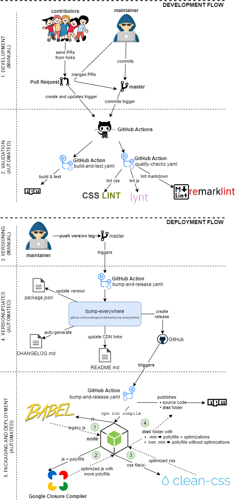

# ez-consent

> 🍪 Minimal & vanilla JS only cookie consent banner with no dependencies.

[](https://www.npmjs.com/package/ez-consent)
[](https://www.jsdelivr.com/package/npm/ez-consent)
[](https://github.com/undergroundwires/ez-consent/issues)
[](./.github/workflows/publish.yaml)
[](./.github/workflows/build-and-test.yaml)
[](./.github/workflows/bump-and-release.yaml)
[](./.github/workflows/quality-checks.yaml)
[](https://github.com/undergroundwires/bump-everywhere)
<!-- [](https://www.npmjs.com/package/ez-consent) -->

- Vanilla JavaScript only ✔️
- It does not track you ✔️
- Very lightweight with no dependencies ✔️
- Single line to get going ✔️

[Live example 1](https://cloudarchitecture.io/?force-consent), [Live example 2](https://erkinekici.com/?force-consent), [CodePen examples](https://codepen.io/collection/XRjMGP)

## Usage

1. [Import](#1-import-the-script)
2. [Initialize](#2-initialize-the-script)
3. [Style](#3-style)

### 1. Import the script

#### Option A: CDN

It's the simplest way. Just add it to your page:

```html
<script type="text/javascript" src="https://cdn.jsdelivr.net/npm/ez-consent@1.1.1/dist/ez-consent.min.js"></script>
```

#### Option B: Install

- Using NPM: `npm install ez-consent --save`
- Or using yarn: `yarn add ez-consent`
- Or as a git submodule (not recommended):
  - Go to the folder you wish to have the repository
  - Run `git submodule add https://github.com/undergroundwires/safe-email`

Add it to your page:

```html
<script type="text/javascript" src="/node_modules/ez-consent/dist/ez-consent.min.js"></script>
```

Or you can import `ez_consent` as a module:

```html
<script type="module">
  import { ez_consent } from './ez-consent/src/ez-consent.js'; // /node_modules/ez-consent/ez-consent.js ...
  ez_consent.init();
</script>
```

Or import it via `webpack`, `gulp`, `rollup` etc.:

```js
import { ez_consent } from "./node_modules/ez-consent/src/ez-consent"
```

*[top↑](#ez-consent)*

### 2. Initialize the script

```js
ez_consent.init();
```

or with all optional options:

```js
ez_consent.init(
  {
    always_show: false,               // Always shows banner on load, default: false
    privacy_url: "/privacy",          // URL that "more" button goes to, default: "/privacy/"
    target_attribute : "_blank",      // Determines what the behavior of the 'more' button is, default: "_blank", opens the privacy page in a new tab
    texts: {
      main: "We use cookies",         // The text that's shown on the banner, default: "This website uses cookies & similar."
      buttons:
      {
        ok: "ok",                     // OK button to hide the text, default: "ok"
        more: "more"                  // More button that shows the privacy policy, default "more"
      }
    }
  });
```

The banner will be shown if the user has not yet agreed to read & understand the information.
You can also force to show banner always by having `force-consent` query parameter in URL. E.g. : `test.com/fest?force-consent`

*[top↑](#ez-consent)*

### 3. Style

#### Existing themes

You can choose one of the following existing theme to get going:

##### box-bottom-left.css



[Source file](./src/themes/box-bottom-left.css) | [See it live](https://cloudarchitecture.io/?force-consent) | [Preview on CodePen](https://codepen.io/undergroundwires/pen/qBdzmyj)

```html
<link rel="stylesheet" href="https://cdn.jsdelivr.net/npm/ez-consent@1.1.1/dist/themes/box-bottom-left.min.css">
```

##### subtle-bottom-right.css


[Source file](./src/themes/subtle-bottom-right.css) | [See it live](https://erkinekici.com/?force-consent) | [Preview on CodePen](https://codepen.io/undergroundwires/pen/MWwMmqw)

```html
<link rel="stylesheet" href="https://cdn.jsdelivr.net/npm/ez-consent@1.1.1/dist/themes/subtle-bottom-right.min.css">
```

#### Custom themes

Or you can create your own theme & import it. Check example themes at [existing themes](./src/themes/). [The HTML](./src/ez-consent.js#L18) uses only a few classes using [BEM](http://getbem.com/naming/) naming convention.

You're welcome to contribute your theme to the project in [`./src/themes`](./src/themes/) folder by creating a pull request 👍.

*[top↑](#ez-consent)*

## Package contents

The deployed packages includes a `dist/` folder that adds polyfills to the files and distributes them as:

- minified (`.min.js`, `.min.css`) files for production usage
- non-minified (`.js`, `.css`) files for debugging

*[top↑](#ez-consent)*

## GitOps

CI/CD is fully automated for this repo using different Git events & GitHub actions.



*[top↑](#ez-consent)*
